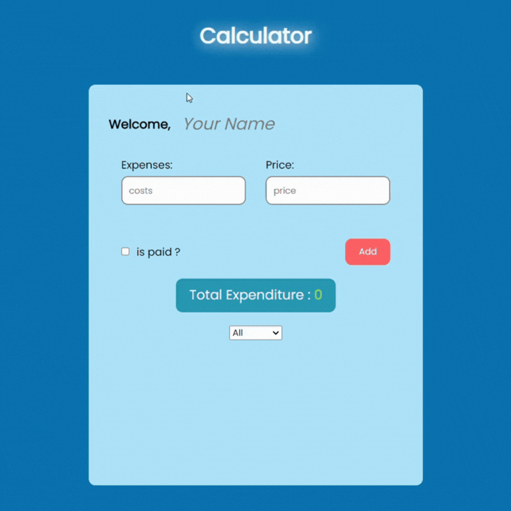

## Calculator

Tout d'abord, saisissez vos dépenses et leurs prix respectifs. Cela est important pour que le calcul soit effectué correctement.

## Calcul

Les prix de vos dépenses saisies sont additionnés et le total de vos dépenses est calculé. De plus, les montants payés et impayés sont calculés et affichés.

Mise à Jour du Statut de Paiement
Lorsque vous payez ou ne payez pas une dépense, mettez à jour le statut de paiement en cochant la case à côté de la dépense concernée. Cela met à jour les montants payés et impayés.

## Méthodes Utilisées

- HTML : Utilisé pour créer la structure de l'interface utilisateur.
- CSS : Utilisé pour définir le style de l'interface utilisateur.
- JavaScript : Utilisé pour effectuer les calculs de dépenses et les mises à jour du statut de paiement.

Ces traductions vous aideront à comprendre le fonctionnement de l'application ainsi que les technologies utilisées.

## GIF

